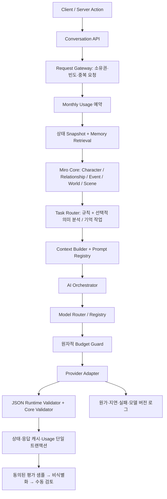

# MIRO AI Platform — 구현 보고서

> **2026-09-15 요금 정책:** 제품 방향은 [Miro Free / Pro 요금 정책](MIRO_PRICING_POLICY.md)을 우선한다. 아래 구현 기록과 구분하며, 새 정책의 깊이·빈도 혜택은 아직 구현 완료가 아니다.

> **2026-09-15 후속 적용:** 사용자 승인으로 프로젝트 `rmuirlqxuxzpqoqeceej`에 0024 마이그레이션을 적용했다. Supabase 이력 `20260914150723`에 기록했고, 동의 컬럼·RLS·계정 조회를 검증했다. 아래 2026-09-14 보고서의 “실제 DB 미적용”은 당시 상태를 설명한다.

2026-09-14 · 기준 커밋 `f46f935` 이후 로컬 변경. 사용자 제공 Production AI Architecture의 Phase A–E를 기준으로 기존 코어를 확장했다. 실제 서비스 DB 적용·배포·유료 API 호출·모델 학습은 수행하지 않았다. 새 의존성 설치는 없다.

## 1. 기존 Architecture 분석

Next.js 사용자 앱/관리자 앱, 순수 domain, engine, providers, Drizzle DB, config로 이미 분리되어 있었다. 알파 API와 정식 대화는 `runConversationTurn`을 공유하고, 관계 규칙·의미 사건·기억·NPC·장면·선연락 스케줄러와 상태 버전 검증도 존재했다.

기존 한계는 단일 모델 체인에 묶인 생성, 모델별 가격/역량/프롬프트 버전 정보 부족, 호출 후 비용 기록, 동시 비용 제한의 경쟁 조건, 5시간 사용량 창이었다. 관계 규칙에 LLM의 추가 delta가 개입했고 메모리는 세션 전체를 먼저 읽었다. 운영 로그와 평가·학습 데이터의 별도 관리 기반도 없었다.

## 2. 변경된 Architecture



Core는 특정 Provider SDK를 호출하지 않는다. Task와 모델을 분리했고, Free/Pro 플랜은 Model Router의 입력에 포함하지 않는다. 물리적으로 마이크로서비스를 늘리지 않고 기존 모노레포 경계를 사용했다.

## 3. 새 파일

주요 새 영역은 `packages/providers/src/ai/{tasks,model-registry,anthropic,miro-slm,data,evaluation}.ts`, `ai/prompts/registry.ts`, `packages/engine/src/task-router.ts`, `packages/config/src/ai-policy.ts`다.

웹에는 `lib/ai/`의 gateway/memory/evaluation/maintenance/media-budget, `instrumentation.ts`, 사용량 API, 동의·피드백 API, AI 개선 참여 설정을 추가했다. 관리자에는 `/ai`, `/api/ai/stats`와 집계 모듈을 추가했다. DB migration 0024, `ai/evals`, `ai/training`과 회귀 테스트도 추가했다. 전체 목록은 마지막 부록에 있다.

## 4. 수정 파일

기존 engine/context/orchestrator/validator, provider orchestrator/resolve/adapters, usage guard, snapshot/turn/commit, 미디어·리얼리티, 사용자 삭제·결제 자격, 요금 화면·입력기, DB schema, 테스트/CI, 환경변수 예제를 수정했다. 전체 목록은 부록에 있다. 원 기획서 본문은 수정하지 않았으며 최신 사용자 지시에 따라 5시간 정책만 월간 정책으로 대체했다.

## 5. AI 요청 전체 Flow

1. 로그인된 `/chat` 서버 액션과 `/api/chat`이 같은 `runConversationTurn`에 진입한다. API는 UUID `Idempotency-Key`를 받으며 입력기는 요청 UUID를 만든다.
2. Gateway가 세션 소유권·삭제/제한 상태·분당 요청 수를 검사한다. 같은 사용자/세션/입력/키의 완료 요청은 저장된 결과를 반환한다. 같은 키의 다른 입력, 진행 중 요청, 세션 동시 요청은 차단한다.
3. 사용자별 월간 풀에서 중요도에 해당하는 사용량을 예약한다. API 원가와는 별도 원장이다.
4. 제한된 최근 대화와 관련 기억을 읽고 규칙 기반 의미 사건·관계 변화·캐릭터 상태를 계산한다. 플래그가 켜져 있으면 필요한 보조 분석을 추가한다.
5. Context Builder가 현재 상태와 프롬프트 버전을 조립한다. Orchestrator가 Task에 맞는 모델 후보를 고른다.
6. **외부 호출마다** 비용·요청 수를 DB에서 원자적으로 예약한다. 허용된 호출만 Provider에 전달한다.
7. 응답을 런타임 스키마로 검증한다. 실패한 JSON도 실패 호출로 기록한다. Core가 delta·사건·NPC·기억 제안을 추가 검증한다.
8. 최신 상태 버전, 응답 결과 캐시, 메시지·관계·세계·기억, 사용량 커밋을 한 트랜잭션에서 확정한다. 경쟁 시 최신 상태로 한 번만 다시 시도한다.
9. 기존 Event/Reality 조건에 따라 선연락을 평가한다. 샘플링이 켜져 있고 별도 평가 동의가 유효할 때만 비식별화 평가 샘플을 저장한다.

오류로 확정되지 못한 대화 사용량은 환불한다. 프로세스 중단으로 남은 대화 예약은 기존 스케줄러가 만료 lease를 정리한다. 이미 완료된 요청을 재전송해도 관계 변화나 차감이 반복되지 않는다.

## 6. Model Router 동작

9개 Task는 `dialogue`, `semantic_event`, `relationship_analysis`, `memory_extraction`, `memory_summary`, `event_generation`, `world_update`, `image_prompt`, `moderation`이다. 능력 선언과 라우팅은 모두 지원한다. 현재 주 대화 파이프라인에서 분리 실행하는 작업은 dialogue와 선택적 semantic/memory 작업이다. 나머지는 기존 코어/기능의 호출 태그 또는 이후 독립 분석을 위한 계약이다.

`emotionalIntensity`, `relationshipImpact`, `memoryImportance`, `eventPotential`, `complexity`를 0–1로 계산한다. 다섯 점수의 최댓값을 중요도로 사용한다. 0.35 미만은 small, 0.85 미만은 standard, 그 이상은 premium을 우선한다. 실제 문맥 크기·enabled·capabilities를 만족하는 모델만 후보가 된다. 해당 tier가 없으면 적합한 인접 tier로 이동하며 후보는 최대 3개다. 이 점수는 휴리스틱이며 감정 이해의 정확도를 실측한 ML 점수가 아니다.

유료 플랜이라 고급 모델을 강제하지 않는다. 플랜은 월간 양과 원가 제한에만 사용된다. 분류기 활성 시 confidence 0.8 이상의 의미 사건을 규칙 결과에 병합한다. Continuity는 small tier만 허용한다.

## 7. Context Builder 동작

캐릭터 정체성·성격·말투, 현재 캐릭터 상태·관계, 장소·시간·장면, 관련 기억, 진행/최근 종료 사건, 활성 NPC, 제한된 최근 메시지를 사용한다. 전체 대화 기록을 전송하지 않는다.

문맥 예산을 넘으면 기억과 최근 메시지를 단계적으로 줄인다. 정체성을 지키고도 맞지 않으면 `context_budget_exceeded`로 실패하며 무제한 문맥을 보내지 않는다. 토큰 추정은 간이 추정이며 모델 선택과 비용 예약은 더 보수적인 UTF-8 바이트 수를 사용한다.

프롬프트 버전은 요청마다 기록하며 `MIRO_PROMPT_EXPERIMENTS`로 세션별 일관된 A/B를 지원한다. 내부 상태 숫자를 출력하지 말라는 지시와 RP 출력의 내부 수치 노출 검사를 함께 둔다. 이 검사는 알려진 표현을 대상으로 하며 모든 의미적 유출을 완벽히 탐지하는 장치는 아니다.

## 8. Relationship Engine 연결

`Semantic Events → Relationship Rules → codeDelta`가 최종 관계 변화를 결정한다. 기존 LLM delta 보정을 제거했다. AI가 관계 변경 숫자를 제안하더라도 실제 관계에 반영하지 않는다. 신뢰·질투·거리·애착 등 기존 clamp와 단계 전이 규칙을 유지했다.

캐릭터 감정·사건·세계·장면은 같은 snapshot을 사용한다. Event Engine과 기존 스케줄러/quiet hours/쿨다운을 유지했으며, 이미지 추론을 리얼리티 발송 DB 트랜잭션 밖으로 이동했다.

## 9. Memory 연결

| 계층 | 현재 구현 |
|---|---|
| Working | 제한된 최근 메시지 |
| Short-Term | `short_term_summary` 기억 |
| Long-Term | 사용자 사실·취향·약속 |
| Relationship | 공동 사건·갈등·관계 변화 |
| World | `world_fact`, 세계와 NPC 사실 |

`MemoryRetriever.retrieve(MemoryQuery)`는 사용자와 세션을 함께 검사한다. SQL의 어휘 일치·중요도·최근성을 사용해 제한된 후보를 읽고 Core가 Top-K를 선택한다. 타인의 세션은 빈 결과다. embedding/vector 검색으로 교체할 수 있지만 지금은 벡터 DB나 임베딩 호출을 추가하지 않았다.

`memoryExtraction`, `memorySummaries`는 기본 OFF다. 추출은 기억/약속 관련 입력에만, 요약은 현재 12턴 간격의 조건에서 실행한다. 추가 분석은 공통 사용량과 원가 예산을 모두 사용한다. 분석 실패 시 규칙 기반 결과와 기존 기억으로 진행한다.

## 10. Usage Unit 계산

`packages/config/src/ai-policy.ts`의 가중치 × 사용량으로 계산한다. 현재 개발 기본값은 다음과 같다. 운영 확정 가격표가 아니다.

| 작업 | 기본 Unit |
|---|---:|
| 일반 대화 / 복잡한 대화 / 중요 사건 | 1 / 2 / 3 |
| 의미 분석 / 기억 추출 / 기억 요약 | 각각 1 |
| 사진 / Face Cast / 배경 / Live Scene | 10 / 15 / 8 / 12 |
| 음성 / 영상 통화 | 분당 5 / 20 |

`MIRO_USAGE_POLICY.weights`로 바꾼다. 미디어 캐시 적중은 새 생성이 아니므로 차감하지 않는다. 단순 선연락은 기존 정책상 기본 무차감이지만 내부 Provider 원가는 반드시 예산 제한을 받는다. 별도 충전권이나 기능별 결제는 추가하지 않았다.

Usage 원장과 AI 호출 원가는 분리된다. 실패 재시도는 사용자에게 새 대화 차감을 만들지 않아도 Provider 비용을 소비할 수 있다. 따라서 관리자 AI 로그의 usageUnits 합계는 사용자 청구 원장의 대체물이 아니며, 실제 사용자 차감의 기준은 `usage_ledger`다.

## 11. Free/Pro Usage 처리

Asia/Seoul **매월 1일 00:00** 시작, 다음 달 1일에 초기화되는 월간 풀이다. Free 100 / Pro 1000은 개발 기본값이고 환경 설정으로 변경한다. 업그레이드는 현재 월의 한도를 바로 늘리며 이미 사용한 양은 유지한다.

기존 5시간 창은 migration 0024에서 `legacy`로 남긴다. 전환 후 첫 월간 풀은 새로 시작하며 과거 5시간 사용량을 임의로 월 단위로 환산하지 않는다. 서비스 전환 시 이 일회성 새 풀 제공을 운영 공지에 반영해야 한다.

`GET /api/usage`는 plan, monthly, usedPercent, resetsAt, continuity 정보만 반환한다. 화면은 “이번 달 AI 사용량”과 백분율을 표시한다. 토큰·Provider 가격·모델 선택은 노출하지 않는다. 기능 플래그는 서비스 모드에 적용되고 요금제별 품질/기능 차등은 없다.

Continuity는 별도 opt-in 설정이다. 활성 시 월간 풀 소진 뒤 지정된 소량의 텍스트만 small 모델·짧은 출력으로 허용한다. 이미지·통화·보조 분석에는 적용하지 않는다. 상태와 기억은 사용량 소진 때문에 삭제하지 않는다.

## 12. Provider failover

Gemini, OpenAI 호환, Anthropic, Cloudflare, Miro SLM, Mock을 동일 인터페이스로 사용할 수 있다. `healthCheck`는 생성 없이 모델/서비스 상태를 확인한다. 실행 시 timeout + AbortSignal, 후보당 최대 1회 재시도, 최대 3개 후보로 제한한다. JSON 오류도 재시도/다음 모델 대상이다. 각 시도는 별도 원가 예약을 거친다.

후보가 실패하면 기존 Core의 안전한 캐릭터 fallback을 사용할 수 있다. 모든 후보가 예산에서 막히면 예산 거절로 반환한다. 키 누락/알 수 없는 가격을 무료 성공으로 취급하지 않는다. 아무 Provider도 설정하지 않은 개발 환경만 명시적인 Mock이다.

[Anthropic Messages API](https://platform.claude.com/docs/en/api/messages/create)와 [vLLM OpenAI 호환 API](https://docs.vllm.ai/en/stable/serving/openai_compatible_server/)의 계약을 사용했다. 어댑터는 fetch 기반이며 새 SDK 의존성을 설치하지 않았다.

## 13. Budget Guard와 관측

원가 예산은 USD이고 사용자 Unit과 독립적이다. global / user / IP / plan / provider / model의 요청 수·비용 제한을 지원한다. IP 제한은 분 단위, 나머지 원가/호출 제한은 KST 일 단위다. 전역 기본 비용 한도는 **0 USD**다. 실모델 사용에는 검증된 가격과 명시적인 예산이 필요하다.

정렬된 budget key를 짧은 DB 트랜잭션에서 잠그고 비용 상한과 attempt 로그를 함께 예약한다. 네트워크 추론 중에는 이 잠금을 유지하지 않는다. 정상 응답은 보고된 토큰으로 예약 차액을 정산한다. timeout처럼 사용량을 모르면 예약 원가를 남겨 잠재 청구를 숨기지 않는다. Unknown price는 거절한다. 이미지에는 `MIRO_MEDIA_COSTS`의 종류별 호출 원가 상한을 같은 guard에 적용한다.

로그 필드: traceId/requestId/attemptId, 사용자/세션, task, Provider/모델/버전, promptVersion, 지연, 토큰, Unit, estimatedCost, reservedCost, nullable actualCost, 성공/실패, fallback, shadow. 원본 프롬프트/응답·API 키·private reasoning은 운영 AI 로그에 저장하지 않는다. IP는 호출 생성 시 해시한다.

관리자 `/ai`와 `/api/ai/stats`는 최근 24시간 모델/작업/프롬프트별 집계와 최근 호출 메타데이터, 예산 데이터를 제공한다. `actualCost`는 Provider 청구 정산 전에는 **null**이며 추정 원가를 실청구라고 표시하지 않는다. 실제 인보이스 동기화는 미구현이다.

추가 테이블과 `ai_usage`는 RLS를 활성화하고 브라우저용 역할에 직접 접근 정책을 주지 않았다. 인증된 서버 엔드포인트를 통해서만 접근한다. [Supabase API 보안 문서](https://supabase.com/docs/guides/api/securing-your-api)의 RLS 경계를 따르되 운영 DB 역할/권한도 배포 시 확인해야 한다.

## 14. 모델 교체 및 운영 설정 방법

`.env.example`에 실행 가능한 Mock registry 예제가 있다. 실제 모델은 `MIRO_MODEL_REGISTRY` JSON 배열에서 alias는 유지하고 Provider/model/version/가격/capabilities를 교체한다. 가격은 **백만 토큰당 USD**다. 사용자 요금표와 별개다.

```json
[
  {
    "id": "small-dialogue",
    "provider": "mock",
    "providerModelId": "mock",
    "tier": "small",
    "capabilities": ["dialogue", "semantic_event", "memory_extraction", "memory_summary"],
    "inputCost": 0,
    "outputCost": 0,
    "maxContextTokens": 32768,
    "maxOutputTokens": 1024,
    "enabled": true,
    "version": "mock-v1",
    "trainingAllowed": false
  }
]
```

| 환경변수 | 용도 |
|---|---|
| `MIRO_MODEL_REGISTRY` | 모델 alias·역량·가격·버전 |
| `MIRO_USAGE_POLICY` | 월간 Free/Pro 한도·가중치·Continuity |
| `MIRO_BUDGET_POLICY` | `global`, `user`, `ip`, `plan:free`, `provider:gemini`, `model:<alias>` 등의 `{requests,cost}` |
| `MIRO_MEDIA_COSTS` | `photo`, `background`, `face_cast`, `live_scene`의 호출당 USD 상한 |
| `MIRO_REQUESTS_PER_MINUTE` | 사용자 대화 요청 한도, 기본 20 |
| `MIRO_PROMPT_EXPERIMENTS` | 예: `{"dialogue":{"version":"v2","percent":10}}` |
| `MIRO_FEATURE_LLM_SEMANTIC_ANALYSIS` | 선택적 의미 분석 |
| `MIRO_FEATURE_MEMORY_EXTRACTION` / `MIRO_FEATURE_MEMORY_SUMMARIES` | 선택적 기억 작업 |
| `MIRO_EVAL_SAMPLE_PERCENT` | 별도 동의가 있는 평가 샘플 비율, 기본 0 |

정책 예: `MIRO_USAGE_POLICY={"version":"monthly-v1","monthly":{"free":100,"pro":1000},"continuity":{"enabled":false}}`. 숫자는 운영자가 확정해야 한다. `MIRO_BUDGET_POLICY`를 제공하면 같은 scope의 기본 제한 객체를 대체하므로 유지할 requests/cost를 함께 적는다.

Provider 키는 해당 서버의 환경변수에만 둔다. `.env.example`은 `MIRO_MODE=production`이며 모든 기능을 Mock으로 점검할 수 있다. 실제 `.env`의 모드는 변경하지 않았다. AI 기능 활성 전 registry 가격, 명시적인 일 예산, healthCheck, 아래 live 평가를 확인한다. `AI_PROVIDER`/`AI_FALLBACK_PROVIDER`는 이전 설정 호환용이며 가격이 없는 legacy 실모델 호출은 guard에서 차단된다. 새 운영 설정에는 Registry를 사용한다.

### DB 적용

이번에 적용한 DB는 `/tmp` 아래 격리한 로컬 검증용 DB뿐이다. 운영 대상에는 migration 0024를 적용하지 않았다.

- Drizzle journal로 0023까지 관리한 DB: 같은 migration 경로로 `pnpm db:migrate` 실행.
- 기존 수동 SQL 방식 DB: 0000–0023 적용 상태를 확인한 뒤 0024만 `psql "$DATABASE_URL" -v ON_ERROR_STOP=1 --single-transaction -f packages/db/migrations/0024_ai_platform.sql`로 적용하고 migration 이력을 맞춘다.
- 빈 DB: 0000–0024 순서대로 적용 후 seed한다. 기존 `db:migrate:sql`은 전체 재실행용이므로 이미 운영 중인 DB에 무조건 실행하면 안 된다.

새 사용자/DB 컬럼이 필요하므로 스키마를 먼저 적용하고 두 앱을 배포한다. `instrumentation.ts`가 웹 서버 시작 시 원가 guard와 usage sink를 연결한다. Cron이 만료 예약과 30일 평가 샘플 정리도 수행한다.

## 15. 향후 MiroSLMProvider를 연결할 정확한 위치

`packages/providers/src/ai/miro-slm.ts` → `OpenAICompatibleProvider` → 별도 inference 서버의 `/v1/chat/completions`다. `MIRO_SLM_URL`은 `/v1`을 포함한 base URL, `MIRO_SLM_MODEL`은 서버가 노출하는 모델 이름, 필요하면 `MIRO_SLM_API_KEY`를 설정한다. GPU는 앱 서버와 분리한다.

Registry에 `provider: "miro-slm"`과 해당 작업 capabilities를 추가한다. 자체 모델도 무료로 가정하지 말고 운영 원가를 가격에 반영한다. 교체 순서는 Router/의미 사건 → Memory 추출·요약 → Character Dialogue다. 관계 수치 결정은 계속 Core에 남는다.

출시 흐름은 Golden 평가 → shadow → 승인된 canary다.

- `MIRO_SHADOW_MODEL=<alias>`: 평가에 동의한 요청만 같은 입력으로 비교한다. 결과는 사용자 응답에 쓰지 않고 별도 원가로 기록한다. 현재 동시 실행 후 최대 2초를 기다리는 bounded 방식이다.
- `MIRO_CANARY_MODEL=<alias>`, `MIRO_CANARY_APPROVED=1`, `MIRO_CANARY_PERCENT=1`: 안정적인 사용자 cohort로 시작한다. 운영자가 1 → 5 → 10 → 25 → 50 → 100으로 변경한다.
- `MIRO_MODEL_ROLLBACK=1`: 즉시 SLM canary/shadow를 제외하고 등록된 외부 fallback 경로를 사용한다.

SLM은 regular 후보에서 항상 제외되어 승인 플래그 없이 우회 투입되지 않는다. 100%에서도 승인된 canary 설정을 유지한다. 외부 fallback 모델은 enabled 상태로 남겨야 한다. 승인 값은 사람의 운영 결정을 표현하는 배포 설정이며 자동 품질 판정 서비스가 아니다.

## 16. 현재 운영 기반으로 사용할 수 있는 부분

코드와 격리 환경에서 검증한 범위는 Provider/task 분리, Registry/Router, 구조 검증, 결정론적 관계 규칙, 제한된 문맥·기억 검색, 대화 중복 방지와 원자적 Usage, 월간 풀/UI/API, 호출 전 비용 제한, 메타데이터 관측, 기본 동의 관리, 평가 실행기, shadow/canary/rollback 연결 지점이다.

이것은 **Production 기반 구현 완료 범위**이며 실서비스 승인이나 전체 제품 완성을 뜻하지 않는다. 운영 키·가격·DB·모델 품질·실제 트래픽 검증 없이 “즉시 대규모 운영 가능”으로 판정하지 않았다.

### 검증

- 격리 Postgres에서 SQL 0000–0024 전체 25개 적용 및 공식 캐릭터 seed 성공.
- Vitest: **39개 파일, 299개 테스트 통과**. 비용 동시 예약, 미확인 가격 차단, 이미지 비용 guard, 중복/환불 경쟁, 대화 재전송, 세션 소유권, 동의된 평가 수집 등을 포함한다.
- root/web/admin TypeScript 검사 통과.
- web/admin 프로덕션 빌드 통과.
- Golden reference harness: **10개 시나리오 × 2개 프롬프트 버전 = 20/20 검사 통과**. 실제 모델 품질 점수는 아니다.
- RLS: SELECT 권한을 임시로 받은 비특권 역할에서도 5개 AI 내부 테이블의 행이 노출되지 않음을 확인.
- 관련 Playwright E2E: **14/14 통과**. 월간 사용량/업그레이드/동의 및 인증, 채팅, 사진, Live Scene, 통화 흐름을 Mock으로 검증했다. AI 개선 참여 화면을 캡처해 텍스트·체크박스·버튼 배치를 확인했다.

## 17. 아직 구현되지 않은 부분

- **실모델 품질 평가**: 합성 Golden 10개(첫 만남/질투/고백/싸움/화해/무응답/이별/비밀/기억/NPC)는 실행 계약이다. 한국어 자연스러움·감정·일관성 등 의미 품질 점수는 미평가(null)이며 사람이 검토해야 한다. 정규식 통과를 품질 점수로 포장하지 않았다.
- **실제 SLM**: base model 선정, 상업 라이선스 확인, 모델별 GPU/VRAM benchmark, SFT/DPO 학습 job, weights, vLLM 배포는 없다. 모델을 미리 고정하지 않았다.
- **데이터 운영**: 평가 샘플은 기본 OFF, `allowEvaluation`과 `allowTraining`은 독립적이며 기본 false다. 평가 샘플은 비식별화 후 pending review로 저장되고 30일에 정리된다. 철회/계정 삭제 시 관련 샘플·피드백을 제거한다.
- **학습 파이프라인**: 현재 `buildTrainingDataset`은 사전 동의 + 현재 동의 재확인 + Provider 학습 허가 + 수동 개인정보 검토 + 품질 4점 이상 + 민감정보 필터 + 중복 제거 + 대화별 split을 거친 후보만 SFT/DPO 형식으로 만드는 라이브러리다. 원본 DB 자동 export/train은 없다. 이미 반출된 dataset의 삭제 전파, 검수 UI, 학습 추적 저장소는 후속 구현이다.
- **피드백**: 동의·소유권을 검사하는 신호 저장 API와 테이블은 있다. regenerate/like/이탈 등 모든 실제 UX 이벤트를 자동 연결한 것은 아니다. DPO는 명시적 선호가 있는 검수된 쌍만 만든다.
- **Media**: 기존 Voice/Video는 LiveKit 토큰·통화 상태·공유 시뮬레이션/사용량까지이며 실제 음성 AI agent/영상 아바타 transport는 아직 없다. AI 생성 이미지의 영구 보관·URL 만료 처리는 별도 작업이다.
- 자동 invoice 원가 정산, embedding/vector retrieval, 학습된 router, 운영 정책 편집 UI, 자동 canary 승격/품질 모니터는 없다.

실제 비교 실행은 설정 후 `MIRO_EVAL_MODELS=<alias1>,<alias2> MIRO_EVAL_PROMPTS=v1,v2 MIRO_EVAL_MAX_COST_USD=<허용예산> pnpm ai:eval --live`로 한다. 이 runner는 명시적 예산 상한 안에서 순차 실행하고 결과 텍스트/기계 검사/지연/추정 원가를 JSON에 남긴다. 기본 출력은 `/tmp/miro-ai-eval-report.json`이며 `MIRO_EVAL_OUTPUT`으로 바꿀 수 있다.

## 18. 기술부채와 다음 작업

1. **대규모 비용 집계**: 전역 예산 row 잠금은 작은 서비스에서 정확성을 우선한 구조다. 수십만 사용자 단계에는 원자적 별도 quota 서비스/집계 partition, 비동기 로그 sink, 부하 시험이 필요하다. 지금은 무제한 동시 확장 성능을 보장하지 않는다.
2. **전체 모달리티 Gateway 통합**: 주 대화와 알파는 완전한 요청 replay를 지원한다. 기존 통화/Live Scene 액션도 같은 Core·Usage·원가 guard를 쓰지만 주 대화의 요청 캐시 경계를 그대로 통과하지 않는다. 미디어 캐시 miss 동시 생성의 dedupe/오래된 미디어 예약 회수도 별도 강화 대상이다.
3. **프롬프트·컨텍스트 발전**: 중앙 task 템플릿을 도입했지만 기존 캐릭터 draft/외형·동적 Core context의 상세 문구는 각 builder에 남아 있다. 학습/모델 비교를 확대할 때 전체 조립 결과의 버전 hash와 production-context replay 평가를 추가해야 한다.
4. **장애 시 정산**: Provider 비용 예약과 앱 상태 커밋은 다른 수명이다. timeout·프로세스 중단의 비용을 보수적으로 보유한다. 최종 invoice 정산 및 ambiguous request 재처리 워커가 필요하다. 사용자 원장의 확정값을 과금 기준으로 삼는다.
5. **개인정보 검토**: 정규식 비식별화는 모든 개인정보를 찾아내지 못한다. 평가/학습 export 전 사람의 검수가 필수다. 단순 학습 허용 flag는 Provider 약관 검토나 dataset 반출 승인을 대신하지 않는다.
6. **테스트 확대**: 실제 모델별 prompt injection·장기 기억·내부 정보 노출·비용 회귀, 부하 시험, 운영 역할 RLS, canary 서비스 지표를 평가해야 한다. 기본 Golden은 합성 reference fixture라 production 전체 코어 품질을 측정하지 않는다.
7. **기존 이력 관리**: 과거 마이그레이션 일부는 수동 SQL 이력이므로 실 DB의 journal과 대조해야 한다. 이번 문서가 이전 기획의 5시간 풀과 과거의 “전체 완료” 판단보다 우선한다.

## 부록: 변경 파일 전체 목록

파일명은 저장소 루트 기준이다.

### 새 파일 (32)

```text
.Codex/pm-status.md
ai/evals/golden.json
ai/evals/run.ts
ai/training/README.md
apps/admin/app/ai/page.tsx
apps/admin/app/api/ai/stats/route.ts
apps/admin/lib/ai.ts
apps/web/app/(main)/my/ai-data/page.tsx
apps/web/app/api/ai/consent/route.ts
apps/web/app/api/ai/feedback/route.ts
apps/web/app/api/usage/route.ts
apps/web/instrumentation.ts
apps/web/lib/ai/__tests__/platform.integration.test.ts
apps/web/lib/ai/evaluation.ts
apps/web/lib/ai/gateway.ts
apps/web/lib/ai/maintenance.ts
apps/web/lib/ai/media-budget.ts
apps/web/lib/ai/memory.ts
docs/MIRO_AI_PLATFORM.md
e2e/ai-platform.spec.ts
packages/config/src/ai-policy.ts
packages/db/migrations/0024_ai_platform.sql
packages/db/migrations/meta/0024_snapshot.json
packages/engine/src/task-router.ts
packages/providers/src/__tests__/platform.test.ts
packages/providers/src/ai/anthropic.ts
packages/providers/src/ai/data.ts
packages/providers/src/ai/evaluation.ts
packages/providers/src/ai/miro-slm.ts
packages/providers/src/ai/model-registry.ts
packages/providers/src/ai/prompts/registry.ts
packages/providers/src/ai/tasks.ts
```

### 수정 파일 (57)

```text
.env.example
.github/workflows/ci.yml
README.md
apps/admin/app/layout.tsx
apps/web/app/(alpha)/alpha/chat/chat.tsx
apps/web/app/(main)/chat/[sessionId]/actions.ts
apps/web/app/(main)/chat/[sessionId]/composer.tsx
apps/web/app/(main)/my/page.tsx
apps/web/app/(main)/my/subscription/page.tsx
apps/web/app/(main)/plans/page.tsx
apps/web/app/(main)/subscribe/page.tsx
apps/web/app/api/alpha/stats/route.ts
apps/web/app/api/chat/route.ts
apps/web/lib/ops/account.ts
apps/web/lib/payments/service.ts
apps/web/lib/reality/__tests__/evaluate.integration.test.ts
apps/web/lib/reality/evaluate.ts
apps/web/lib/reality/scheduler.ts
apps/web/lib/simulation/appearance.ts
apps/web/lib/simulation/commit.ts
apps/web/lib/simulation/media.ts
apps/web/lib/simulation/mock-llm.ts
apps/web/lib/simulation/snapshot.ts
apps/web/lib/simulation/turn.ts
apps/web/lib/usage/__tests__/guard.integration.test.ts
apps/web/lib/usage/ai-usage.ts
apps/web/lib/usage/guard.ts
docs/MIRO_IMPLEMENTATION_PLAN.md
e2e/usage.spec.ts
package.json
packages/config/src/features.ts
packages/config/src/index.ts
packages/db/migrations/meta/_journal.json
packages/db/src/__tests__/session.integration.test.ts
packages/db/src/schema/index.ts
packages/domain/src/__tests__/usage.test.ts
packages/domain/src/memory/layers.ts
packages/domain/src/memory/types.ts
packages/domain/src/usage/types.ts
packages/domain/src/usage/window.ts
packages/engine/src/context.ts
packages/engine/src/orchestrator.ts
packages/engine/src/proposal.schema.ts
packages/providers/src/__tests__/ai-orchestrator.test.ts
packages/providers/src/ai/cloudflare.ts
packages/providers/src/ai/gemini.ts
packages/providers/src/ai/mock.ts
packages/providers/src/ai/openai-compatible.ts
packages/providers/src/ai/orchestrator.ts
packages/providers/src/ai/resolve.ts
packages/providers/src/ai/types.ts
packages/providers/src/character/generate.ts
packages/providers/src/image/replicate.ts
packages/providers/src/index.ts
packages/providers/src/reality/content.ts
packages/providers/src/types.ts
playwright.config.ts
```
