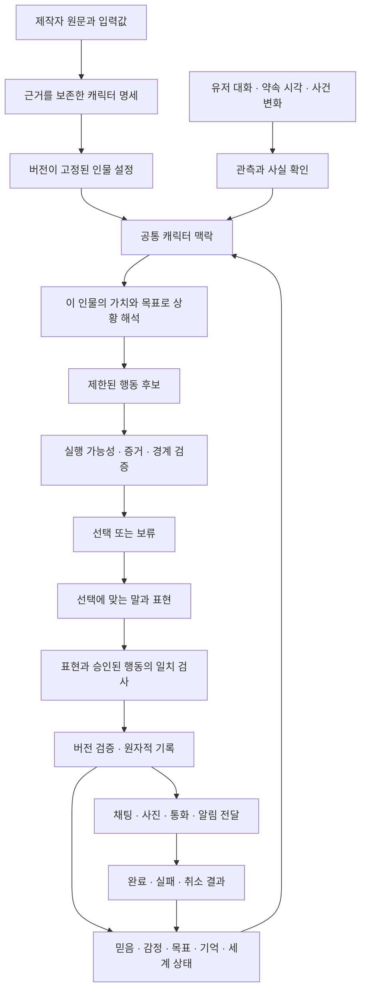

# Miro 캐릭터 자율성 엔진 설계

2026-09-24 · 설계 기준 커밋 `0d02a9c` · **제안/구현 계획**

이 문서는 현재 코드 감사와 원문 연구를 바탕으로 작성했다. 아래 신규 구조·평가 수치·파일명은 구현 제안이며 완료된 기능이나 실측 결과가 아니다. 이번 작업에서 런타임 코드, 운영 DB, 배포, 기능 플래그를 변경하지 않는다.

## 1. 만들려는 경험

제작자는 지금처럼 인물의 성격과 배경을 적는다. 캐릭터는 그 설정을 바탕으로 상황을 해석하고, 자신의 목표와 관계를 고려하여 행동을 선택한다. 이전 선택과 약속은 다음 대화·통화·선연락까지 이어진다. 시간이 지나며 관계와 경험은 변하지만 갑자기 다른 사람이 되지 않는다.

여기서 자율성은 관찰 가능한 제품 동작이다. **설정에 근거한 선택, 지속되는 의도, 상황에 따른 재판단, 결과의 누적**으로 정의한다. 실제 인간의 자유의지나 의식 구현을 성공 기준으로 삼지 않는다. 기술적으로 모방 불가능하다는 약속도 하지 않는다. 장기적으로 축적할 경쟁력은 한국어 캐릭터 행동 데이터, 검증 가능한 상태 모델, 긴 대화의 실패 사례와 평가 체계다.

유저가 느껴야 할 차이:

- 같은 거절을 겪어도 자존심이 강한 사람, 솔직한 사람, 관계보다 일을 우선하는 사람이 다르게 반응한다.
- 말수가 적어도 애착은 깊을 수 있다. 표현이 적다는 이유로 감정 자체를 약하게 계산하지 않는다.
- 내 요구에 무조건 동의하지 않지만, 차별화를 위해 억지로 거절하지도 않는다.
- 먼저 연락하기도 하고 연락을 보류하기도 한다. 이유 없는 랜덤 메시지를 자율성이라고 부르지 않는다.
- 약속을 지키고, 취소되면 멈추고, 할 수 없는 일은 했다고 말하지 않는다.
- 모든 목표가 연애나 유저의 관심에 수렴하지 않는다. 직업·신념·일상·호기심도 행동의 동기가 된다.

## 2. 현재 재사용할 것과 해결할 것

현재 구조에는 순수 domain/engine, Provider 교체, 비용 예약, 세션별 상태, 규칙 기반 관계 변화, 제안 검증, 트랜잭션 커밋, 선연락 스케줄러와 발송 재검사가 있다. 이 기반을 유지하면서 의사결정 모델을 교체한다. 새 마이크로서비스나 여러 LLM 인격의 토론을 먼저 도입할 이유는 없다.

| 확인한 한계 | 현재 근거 | 필요한 변경 |
|---|---|---|
| 성격 문장은 대화에 들어가지만 목표·행동 결정 연결이 얕음 | `packages/engine/src/context.ts`, `packages/domain/src/reality/evaluator.ts` | 원문 근거가 있는 성격 규칙을 행동 선택에 사용 |
| 감정별 목표가 모든 캐릭터에 공통이고 매 턴 대체됨 | `packages/domain/src/character/state.ts` | 성격별 상황 해석, 지속 목표/약속 |
| 감정 표현 수치가 애착·호감의 내부 변화까지 조절 | `packages/domain/src/relationship/apply.ts` | 내부 감정과 외부 표현 분리 |
| 국적·MBTI 등을 읽지만 최종 대화 프롬프트에서 누락, 외형도 일반 대화 스냅샷에 없음 | `apps/web/lib/simulation/snapshot.ts`, `packages/engine/src/context.ts` | 입력 소비처 목록과 공통 맥락 |
| 일반 대화는 내레이터/NPC 기록을 제외, 선연락은 `kind=text`만 읽어 이전 선연락을 제외 | `apps/web/lib/simulation/snapshot.ts`, `apps/web/lib/reality/context.ts` | 역할·종류·관측 권한을 보존한 대화 기록 |
| 채팅과 선연락의 성격·세계 맥락이 다름 | `packages/providers/src/reality/content.ts` | 같은 인물/상태를 채널별로 표현 |
| 의미 사건이 관계 중심 16종이며 정규식 오판을 높은 confidence로 남길 수 있음 | `packages/domain/src/relationship/semantic.ts` | 행위자·대상·시점·부정·인용·가정과 증거 구간 |
| 세계 변경은 주로 문자열 검증이고 서술과 승인된 결과의 일치 검증이 부족 | `packages/engine/src/validator.ts` | 선행조건·권한·시간·증거 검증 후 서술 |
| 기억의 출처 필드가 커밋 시 채워지지 않음 | `apps/web/lib/simulation/commit.ts` | 원문 메시지/사건 출처 연결 |
| `pendingRealityIntent`는 대화마다 갱신/소거되는 예약 하나 | `apps/web/lib/simulation/commit.ts` | 발송 예약과 지속 목표를 분리 |
| 기존 Golden 평가는 실제 엔진 경로를 우회하는 단발 응답 검사 | `ai/evals/run.ts` | 실제 저장부터 시간 경과·발송까지의 장기 평가 |

추가 회귀 항목: 선연락 의도 도출기는 `escalated` 사건을 지원하지만 실제 조회는 `active`만 포함하는 경로가 있다. 상태 조회 범위를 맞춘다. 위 내용은 코드 수준 확인이며 운영 모델의 행동 품질을 실측한 결과는 아니다. 이전 테스트 67개 통과도 자율성 품질의 증명으로 사용하지 않는다.

## 3. 구조: 하나의 의사결정 코어



LLM의 역할은 언어 해석, 조건부 행동 후보 제안, 표현 생성이다. 서버는 정체성·관측 권한·실행 가능성·상태 변경·발송의 최종 권한을 갖는다. 규칙만으로 모든 성격을 열거하지 않고, LLM이 낸 숫자를 그대로 사람의 심리 상태로 확정하지도 않는다.

### 3.1 입력을 실행 가능한 명세로 바꾸기

원문은 삭제하거나 요약본으로 대체하지 않는다. `CharacterRevision`은 원문, 구조화 입력, 해석 결과와 버전을 함께 갖는다. 게시/편집 시 내용 해시가 바뀐 경우에만 컴파일한다.

제안 구조:

```ts
type AuthoredRule = {
  id: string
  domain: 'identity' | 'value' | 'boundary' | 'motive' | 'expression' | 'world'
  statement: string
  source: { field: string; start: number; end: number; revisionId: string }
  origin: 'explicit' | 'inferred' | 'legacy-default'
  confidence: number // 검증 전 모델의 자신감은 보정된 확률이 아니다
  appliesWhen?: Condition // 서버가 허용한 조건 AST, 실행 코드/자유 SQL 금지
  exceptions?: Condition[]
}
```

예: “자존심이 세서 먼저 사과하지 않지만, 본인이 약속을 어긴 경우에는 책임진다.”를 `절대 사과 금지`로 축약하면 실패다. 평소 경향, 예외, 가치 간 우선순위를 같이 남겨야 한다. 열린 자연어 맥락은 원문과 함께 유지하고, 컴파일할 수 없는 조건은 추정 사실로 만들지 않는다.

내부적으로 가치·동기·경계·표현·회복 성향을 다루되, 사용자가 수십 개 슬라이더를 채우게 만들지 않는다. 특정 심리학 분류나 MBTI를 행동의 정답으로 삼지 않는다. 국적·성별·외모에서 성격이나 도덕성을 추론하지 않는다.

**충돌 처리 규칙:**

1. 서비스 권한·유저의 실제 수신 설정은 캐릭터 설정으로 무시할 수 없다.
2. 인물의 사실과 성격은 제작자가 명시한 원문/선택이 기준이다. 대화 유저가 “앞으로 네 성격은 이렇다”고 해도 제작자 설정 수정으로 처리하지 않는다.
3. 자연어와 선택값이 충돌하면 필드별 명시성·범위를 검사한다. 명시 선택값은 해당 축의 기본 강도, 구체적인 원문 조건은 상황별 예외로 사용할 수 있다. 양립 불가능한 경우 하나를 조용히 덮지 않고 편집 화면에 짧은 충돌 확인을 제공한다.
4. 초기 UI 기본값과 사용자가 직접 선택한 값을 구분하는 `explicitFields`를 추가한다. 기존 자료는 `legacy-default/unknown`으로 보존한다. 기본 50이 강한 원문 성격을 무효화하지 않게 한다.
5. 미기입·불명은 중립 사실을 새로 창작할 근거가 아니다. 실행에 꼭 필요할 때만 질문하거나 보류한다.

컴파일은 비동기·멱등 작업으로 처리하고 `pending/ready/failed`와 원문 해시를 남긴다. 미완료일 때는 기존 검증된 대화 경로와 원문을 사용하고 고도화된 자율행동만 보류한다. 무한 로딩이나 설정 유실은 허용하지 않는다. 게시 트랜잭션 안에서 외부 모델을 기다리지 않는다.

### 3.2 모든 입력의 소비처를 명시하기

`input-coverage` 목록에 필드별 저장 위치, 소비 경로, 권위, 테스트, 미사용 이유를 둔다. “모든 데이터 반영”은 모든 필드를 매 턴 프롬프트에 복사한다는 뜻이 아니다.

| 입력 범주 | 실제 소비 경로 | 원칙 |
|---|---|---|
| 이름·나이·국적·직업·MBTI | 인물 지식/자기소개·표현 맥락 | 명시 사실은 답할 수 있어야 함. MBTI/국적은 성격 강제 규칙 아님 |
| 성격 설명·반응 성향 | 조건부 행동 경향·표현·상황 해석 | 원문 근거와 직접 선택 여부 보존 |
| 세계관 | 장소·활동·시간·가능한 행동 | 설명 문자열만 주지 않고 세계의 제한을 추출 |
| 외형·사진 | 자기 외형 지식·미디어 정체성 | 텍스트 설정과 사진이 다르면 조용히 사실을 바꾸지 않음. 시각 추출은 별도 검증 |
| 관계 프리셋·수치 | 새 인스턴스의 초기 관계 | 대화 중 값으로 되돌리거나 반복 초기화하지 않음 |
| 첫 장면·인트로 | 시작 사건·관측·실제 첫 메시지 | 내레이터 정보도 권한에 맞게 기억, 첫 메시지 중복 생성 금지 |
| 상황 예시 | 문체와 반응 방식의 참고 | 실제로 겪은 사건/유저의 발언으로 저장하지 않음 |
| 소개·장르 | 소개/발견·장르 표현 맥락 | 소개 문구를 과거 사건으로 만들거나 장르로 관계를 강제하지 않음 |
| 공개 여부 | 접근·노출 정책 | 성격 입력이 아님 |
| 먼저 연락하기·발신자 이름 | 권한/전달 표현 | 성격이 OFF를 무시할 수 없음 |
| 연락 빈도·연락 주도성 | 현재는 유지, 장기적으로 성격 경향과 통합 | 빈도는 행동 경향, 수신 제한은 별도 정책. 중복 주도성의 우선순위를 명시 |

기존 채널 선호/확률은 현재 hidden 보존 상태다. 신규 정책에서는 성격·목표·세계 맥락으로 수단을 제안하고 권한으로 걸러낸다. 옛 확률이 새 정책에 은밀하게 적용되지 않도록 버전별 읽기 규칙을 둔다. 기존 모드의 값은 마이그레이션 중 보존한다.

### 3.3 한 캐릭터, 사용자별 독립된 삶

`CharacterRevision`은 공유 가능한 제작자 설정이고 `CharacterInstance`는 세션별 경험이다. 사용자 A와 B가 같은 캐릭터와 대화해도 목표·기억·감정·세계 사건이 섞이지 않는다. 공개 캐릭터라는 이유로 비공개 성격 원문이나 대화가 공개 API에 노출되어서는 안 된다.

제안 기본 정책은 **기존 세션의 제작자 버전을 고정하고, 새 세션은 최신 버전을 사용**하는 것이다. 기존 세션의 새 설정 적용은 명시적인 업데이트 동작과 변화 기록을 통해 수행하며 과거 사건은 다시 쓰지 않는다. 삭제·공개 접근·수신 OFF 등 권한 변경은 버전 고정과 무관하게 즉시 재검사한다. 초기에 버전 고정은 신규 실험 세션에만 적용하여 현재 편집 동작을 일괄 변경하지 않는다.

### 3.4 사실, 믿음, 기억, 상상을 구분하기

상태는 다음을 구분한다.

- **정체성/세계의 확정 설정:** 제작자가 지정한 사실.
- **관측:** 발언·행동·성공한 시스템 사건. 출처와 관측자를 갖는다.
- **인물의 믿음:** 관측에서 추론한 해석. 사실과 다를 수 있고 확신 정도가 있다.
- **일어난 사건의 기억:** 승인되고 기록된 경험. 요약은 파생 자료다.
- **미래 의도/약속:** 아직 수행되지 않은 것. 완료 전에는 과거형 사실이 아니다.

“다른 사람과 이야기했다”와 “나를 버리려 한다”를 구분한다. 질투하는 인물은 후자를 의심할 수 있지만 DB의 세계 사실로 확정하지 않는다. 정정·취소는 기존 항목을 덮어 지우는 대신 `supersedes/retracted`와 시점을 남긴다. 최신이라는 이유만으로 무관한 발언이 사실을 덮지 않도록 행위자·대상·적용 시각·출처 권위를 확인한다.

`EvidenceRef`에는 세션, 메시지/사건 ID, 원문 구간, 발생 시각, 관측 시각, 발화자, 대상, 부정/인용/가정 여부, 관측 가능한 인물이 필요하다. 내레이터의 비공개 독백을 모든 캐릭터가 아는 전지적 정보로 넘기지 않는다. 입력이 모호하면 확인 질문을 선택할 수 있어야 한다.

검색은 인물/세션 권한 → 현재 유효성 → 관련 사실·약속·사건 → 의미/어휘 관련성 순서로 설계한다. 증거와 취소된 사실의 버전을 같이 검색한다. 벡터 검색 도입 여부는 한국어 바꿔 말하기·이름·부정·시간 검색의 기존 방식 대비 개선으로 결정한다. 벡터 DB 자체를 기억 문제의 해결로 취급하지 않는다.

요약을 반복 요약해 원문 사실이 변하는 현상, 자기 생성 문장을 근거로 거짓 기억을 확신하는 순환을 차단한다. 결정에 필요했던 출처가 삭제되면 파생 기억/캐시/임베딩도 무효화하고, 남아 있는 요약으로 삭제된 정보를 복원하지 않는다.

### 3.5 성격에 따른 상황 해석과 감정

현재 공통 `MOOD_GUIDE/GOALS`를 그대로 강화하지 않는다. 사건이 이 인물의 가치·목표·관계·기대에 어떤 의미인지 평가하는 `Appraisal`을 둔다.

초기 해석 축은 목표에 도움/방해, 가치 충돌, 책임 주체, 예상과의 차이, 통제 가능성, 불확실성이다. 축마다 원문 규칙/관측/목표 ID를 연결한다. 자기 보고 숫자는 진실로 간주하지 않고 수치 범위·변화량·증거 조건을 서버가 제한한다.

내부 정서는 감정 강도·스트레스·에너지로, 외부 표현은 직접 말하기·숨기기·유머·거리 두기 등으로 분리한다. 화난 사람 모두가 단답하는 규칙을 제거한다. 관계 변화는 의미 사건명 하나에서 전 캐릭터 공통 delta를 만드는 방식에서, 검증된 해석과 캐릭터 경향을 입력으로 받는 bounded reducer로 옮긴다. 모델이 임의로 관계 수치를 쓰지 않는 원칙은 유지한다.

회복과 관성은 시간/사건에 따른다. 메시지를 열 번 보냈다는 이유만으로 다툼이 저절로 풀리지 않아야 한다. 대화 간격, 사과의 내용, 반복된 위반, 이행된 약속을 함께 본다. 장기 성격 변화는 반복된 근거와 제한된 학습률로만 허용하고 정체성 사실·제작자의 명시적 경계는 자동 변경하지 않는다.

### 3.6 목표·약속·계획은 다음 턴에도 살아 있어야 한다

`Goal`은 source/evidence, 우선순위, 시작 조건, 성공 조건, 기한, 충돌 목표, 재검토 조건, 상태를 갖는다. `proposed → active → suspended/completed/abandoned/expired`를 서버 전이로 관리한다. 완료에는 실제 결과 사건이 필요하다.

예: “퇴근하면 연락할게”는 업무 종료 조건과 연락 약속이다. 중간에 점심 이야기를 해도 사라지지 않는다. 유저가 취소하면 중단한다. 퇴근 시각이 정해지지 않았다면 임의의 오후 6시를 약속 시간으로 확정하지 않는다.

연락 예약은 약속의 파생 결과이며 약속 그 자체가 아니다. 현재 `pendingRealityIntent`와 독립된 구조가 필요하다. 목표가 달성됐거나 불가능해지거나 더 중요한 경계와 충돌하면 이유 코드와 함께 재계획한다. 매 턴 완전히 새 목표를 뽑지 않는다.

외부 행동은 별도로 `proposed → authorized → queued → provider_accepted → delivered/answered`와 `failed/cancelled/expired`를 추적한다. 채널마다 지원하는 확인 단계만 기록한다. 큐 적재는 수신 증거가 아니고, 벨이 울림은 대화 완료가 아니며, 읽음 확인이 없는 전달을 읽었다고 확정하지 않는다. “연락 시도” 목표는 발신 결과로, “이야기를 나눔” 목표는 실제 응답/통화 기록으로만 완료한다. 실패한 행동을 기억이 성공으로 바꾸는 것을 금지한다.

비관계 목표도 동일하게 다룬다. 고서 복원가는 작업을 마치려 하고, 탐험가는 길을 찾고, 신중한 동료는 사실을 확인하려 할 수 있다. 제작자가 쓰지 않은 거대한 인생사나 트라우마를 자동으로 덧붙이지 않는다.

### 3.7 행동 후보와 선택

처음에는 유한한 행동 타입으로 시작한다: `respond`, `ask`, `decline`, `defer`, `disclose`, `set_boundary`, `continue_activity`, `contact`, `cancel_commitment`, `wait`. 도메인 행동은 이 타입에 목표·대상·조건을 붙인 스키마로 확장한다. 임의 코드를 실행하는 도구 권한은 주지 않는다.

후보는 `evidenceIds`, `ruleIds`, `goalIds`, 선행조건, 예상 효과, 비용, 만료/재검토 조건, 대상 actor를 갖는다. 최초 상한 제안은 3–5개 후보와 2단계 계획이다. 더 깊은 탐색은 장기 평가에서 효과가 입증된 상황에만 사용한다.

선택 순서:

1. 설정·지식·사용자 행동 권한·세계 가능성·수신 권한에 어긋난 후보를 제외한다.
2. 명시적인 약속/경계와 충돌하는 후보는 예외 근거를 요구한다. 안전/권한 제한은 효용 점수로 상쇄할 수 없다.
3. 남은 후보를 가치 적합성, 목표 진전, 이행 책임, 정서 조절, 관계 맥락, 불확실성, 비용으로 평가한다.
4. 동점에 가까운 허용 후보에만 seed를 고정한 제한적 변동을 적용한다. 다양성은 설정 위반의 면허가 아니다.
5. 선택과 거절 사유 코드, 참조 근거를 기록한다. 임의의 장문 속마음이나 모델의 비공개 추론을 저장하는 구조로 만들지 않는다.

개념식 `score(a) = valueFit + goalProgress + commitmentFit + contextFit - uncertainty - cost`는 설계 설명이지 확정 가중치가 아니다. 캐릭터별 조건과 사전 정의된 제한을 먼저 적용하고, 실제 행동 데이터를 통해 보정한다. 클릭·체류시간·유료 전환을 행동 목적함수로 쓰지 않는다.

`wait`는 선연락에서 정상적인 결과다. 직접 대화에서는 기술 오류와 구분하여 필요한 응답/상태 표시를 제공한다. 유저를 붙잡으려고 죄책감·독점·위기 상황을 만드는 행동은 목표 후보로 채택하지 않는다. 반대로 모든 의견 충돌을 차단하여 캐릭터성을 없애지도 않는다.

### 3.8 대사와 실행 결과가 같은 사실을 말하게 하기

현재의 “응답과 상태 변경을 같이 제안하고 일부만 버리는 방식”은 글에서는 행동을 했는데 DB에는 안 한 상태를 만들 수 있다. 신규 경로는 **행동 계약 검증 → 표현 생성 → 내용 검사 → 버전 재검사와 커밋**으로 구성한다.

표현기는 승인된 `DecisionContract`만 받아 말투·표정·길이를 결정한다. 중요한 사실 주장에는 가능한 한 fact/event ID를 연결한다. 기계적 검증이 가능한 주장과 언어적 모순 탐지를 구분하고, 후자를 완벽하게 해결했다고 주장하지 않는다. 실패 시 제한된 1회 재생성 또는 검증된 최소 응답으로 끝낸다. 실패한 행동을 성공한 것처럼 대체 서술하지 않는다.

커밋 시 snapshot/character revision/state version이 달라졌으면 오래된 결과를 버리고 최신 맥락으로 최대 1회 재판단한다. 계속 충돌하면 보류한다. DB 잠금을 잡은 채 외부 모델/미디어를 호출하지 않는다.

### 3.9 대화 밖 일상과 시간

독립적인 삶은 모든 캐릭터를 1초마다 LLM으로 실행하는 방식으로 만들지 않는다. 세계 내 시간과 현실의 알림 시간을 분리하고 다음 의미 있는 시점을 예약한다: 활동 종료, 약속 기한, 사건 변화, 유저 입력 등.

세션에 `clockPolicy`를 고정한다. 초기 기본은 `scene-driven`: 세계 시간은 승인된 장면 전이로만 진행하며 현실의 하루가 흘러도 자동으로 장면이 다음 날이 되지 않는다. P6의 일상 진행은 검증된 세션에 한해 `elapsed-mapped`로 열고 narrative anchor·UTC anchor·속도·pause 상태를 명시한다. 알림 시각은 항상 wall-clock UTC와 수신자 time zone으로 계산한다. “오늘 저녁”이 세계 시간인지 실제 연락 약속인지 모호하면 확정 예약을 만들지 않는다. DST의 누락/중복 시각, 시간대 변경, 과거 기한, pause/resume도 시험한다.

현 스케줄러의 tick 간격으로 보장할 수 없는 분 단위 약속을 UI나 대사로 확정하지 않는다. next-wake 인덱스·claim lease·세션/사용자별 공정한 처리와 기한 지연 지표를 먼저 갖추고 필요한 해상도를 결정한다. 주기적 wake가 있다는 것과 정확한 시각에 전달한다는 것은 다른 보장이다.

배경 활동에는 허용 장소·가능한 소요 시간·직업/세계 조건·관측 범위가 필요하다. “작업을 마침” 같은 캐릭터 자신의 제한된 활동은 검증 후 세계 사건으로 커밋할 수 있다. 관측하지 않은 유저의 외출·감정·동의, 외부 실세계의 사건을 창작하여 사실로 주장할 수는 없다.

긴 오프라인 시간은 제한된 사건 수로 압축해 진행하고 catch-up 폭주를 막는다. 유저가 열지 않은 동안 대형 사건을 수십 개 만들어 따라갈 수 없게 하지 않는다. 돌아왔을 때의 요약도 실제 커밋된 사건만 사용한다. 일상 시뮬레이션의 강도는 자동 확대하지 않고 출시 단계별로 검증한다.

사진/통화는 선택된 행동을 표현하는 수단이다. 실제 지원·사용자 허용·방해 금지·쿨다운·예산이 모두 만족될 때만 사용한다. 불가능한 경우 메시지 전환은 의미가 같은 경우에만 허용하며, 그렇지 않으면 보류한다. 지원하지 않는 사진을 보낸 척하거나 존재하지 않는 전화 내용을 기억시키지 않는다.

## 4. 예시: 두 인물이 다르게 선택해야 하는 이유

상황: 어제 말다툼했다. 오늘 저녁 연락하기로 약속했으며, 상대는 그 약속을 취소하지 않았다.

| 단계 | A: 자존심이 세지만 약속을 최우선 | B: 감정을 솔직히 말하고 즉시 풀려는 편 |
|---|---|---|
| 해석 | 먼저 손 내키지 않지만 이행 책임은 남음 | 갈등을 방치하면 관계가 손상된다고 판단 |
| 내부 상태 | 서운함이 강하고 표현은 절제 | 서운함과 화해 욕구를 직접 표현 |
| 후보 | 약속대로 짧게 연락 / 미루기 / 사과하며 연락 | 먼저 감정 설명 / 확인 질문 / 약속 시각까지 기다림 |
| 선택 예시 | 약속 시각에 연락하되 바로 화해를 선언하지 않음 | 상황이 허용하면 일찍 화해를 제안 |
| 결과 | 이행 기록은 남지만 갈등은 미해결 | 상대 반응에 따라 화해 진전, 동의 없이 해결 처리하지 않음 |

두 인물 모두 연락할 수 있다. 반드시 반대 행동을 해야 차별적인 것은 아니다. 이유·시점·표현·목표 충돌 해결이 설정에 따라 달라지는지를 평가한다. 인물 이름만 바꾸면 결정은 바뀌지 않아야 하고, ‘약속 최우선’ 규칙을 바꾸면 관련 선택이 달라져야 한다.

## 5. 저장 계약과 실행 신뢰성

초기 물리 저장 구조는 기존 PostgreSQL/Drizzle 안에 둔다. 아래는 논리 테이블 제안이며 신규 테이블 수를 성과 지표로 삼지 않는다.

| 제안 저장 단위 | 핵심 내용 | 소유권/조회 |
|---|---|---|
| `character_revisions` | 원문, compiled spec, hash, compiler/policy version, status | character + revision. 공개 카드 API와 분리 |
| `character_runtime_states` | pinned revision, appraisal/affect, state version, next wake | session당 1행, CAS 갱신 |
| `character_commitments` | 목표/약속, 조건, lifecycle, evidence refs | session + status + dueAt 인덱스 |
| `character_observations` | 사건/관측, actor, source refs, time, validity | session + sequence, 기존 메시지 본문 중복 최소화 |
| `character_decisions` | trigger key, candidate summary, chosen action, versions, 결과 | session + trigger unique, 운영자 접근 제한 |
| 기존 memories 확장 | source refs, belief/fact 구분, valid/superseded 상태 | session 격리 + 유효 사실 조회 |
| 기존 전달 outbox 확장/재사용 | action ID, attempt, delivery status | 발송 단위 중복 키 |

JSONB는 버전된 bounded payload에 사용하고 검색/동시성 필드는 명시 컬럼으로 둔다. 공통 완전한 event sourcing 전환은 하지 않는다. 기존 상태 테이블을 읽기 모델로 유지하고 새 행동의 근거/결과만 작은 append-only 기록으로 붙인다. 개인정보 삭제는 append-only 규칙의 예외다.

핵심 불변식:

- 세션별 일관된 state version과 트리거 키로 하나의 결정을 확정한다. 모든 잠금 순서는 기존 편집·대화·선연락 경로를 포함해 문서화한다.
- 결정·관계·목표·메시지·outbox는 가능한 단일 DB 트랜잭션에서 함께 기록한다.
- 외부 발송은 재시도될 수 있다. DB의 중복 방지와 외부의 정확히 한 번 전달을 혼동하지 않는다. provider idempotency/receipt가 없으면 중복 가능성을 측정하고 제한한다.
- 삭제·접근 제한·연락 OFF·약속 취소는 모델 호출 후와 발송 직전에도 확인한다. 전송 승인 전에 취소됐으면 차단하며 이미 외부로 전달 중인 요청을 회수할 수 있다고 약속하지 않는다.
- 다른 사용자/세션/캐릭터의 근거 ID를 참조한 제안은 거부한다. 작성자 권한은 타인의 대화 상태 읽기 권한이 아니다.
- 노출 스키마는 RLS와 grants를 함께 설계한다. 서버의 강한 DB 권한은 RLS만으로 보호되지 않으므로 서버 쿼리에서도 소유권을 검증한다. [Supabase 공식 RLS 문서](https://supabase.com/docs/guides/database/postgres/row-level-security)
- 기록에는 모델/프롬프트/compiler/policy 버전, 입력 hash, seed, provider mode, 사용한 출처, 채택/거절 이유 코드, 지연·원가를 남긴다. 원문 대화 전체나 무제한 속마음 로그를 복제하지 않는다.
- 재현은 **저장한 모델 출력과 버전된 reducer를 재생**하는 방식이다. 같은 seed로 원격 모델을 다시 호출하면 같은 결과가 나온다고 가정하지 않는다.

## 6. 지연·원가 설계

기존 AIOrchestrator/ModelRegistry/BudgetGuard를 유지한다. 도입 초기에는 새 cognition task를 기존 provider 계약 아래 추가한다. 구독 플랜별로 성격 코어를 다르게 만들지 않는다.

제안 호출 경로:

- 컴파일: 설정 변경 시 1개 작업, 내용 hash 캐시. 변경 없는 게시/재진입에서 재호출하지 않음.
- 단순 대화: 가벼운 관측 처리 + 결정적 후보 선택 + 표현 생성. 기존 moderation 등 필수 호출은 별도 집계.
- 중요한 갈등/약속/새 목표: 구조화 해석·계획 1회 + 표현 1회. 필요 없는 의미분석/기억 호출과 중복 실행하지 않음.
- 검증 실패: 최대 1회 제한된 수정. 무한 토론·재귀 planning 금지.
- 이유가 없는 background wake: DB/규칙 처리 후 종료, LLM 0회.
- 기억 정리/반영: 중요한 상태는 즉시, 나머지는 제한된 비동기 작업. 중요한 취소를 늦은 요약에 의존시키지 않음.

위 숫자는 인지/표현 호출의 초기 상한 제안이다. 실제 원가에는 moderation, 재시도, fallback, 임베딩, 미디어, 평가자 호출을 모두 포함한다. 모델·가격은 구현 시 최신 registry로 확인한다. 현재 측정 없는 금액이나 응답 시간을 약속하지 않는다.

원가 지표는 `완료한 대화 1턴`, `활성 인스턴스 1일`, `의미 있는 선연락 1건`, `compiler revision 1개`별로 기록한다. Phase 0에서 기존 p50/p95, 호출 수, 실패율과 예산을 측정해 수치 게이트를 확정한다. 한도가 없거나 가격이 불명인 live 실험은 시작하지 않는다. 긴 실험도 샤드별 예산/최대 요청/중단 조건을 갖는다.

실험 비용에는 사용자 역할 simulator도 포함한다. `experimentId` 단위 영속 총예산 아래 하위 샤드 예산을 원자적으로 예약하고 재시작해도 누적 예약을 보존한다. 현재 `tooling/validation-budget.ts`는 single-writer·1 USD 이하 계약이므로 여러 ledger로 쪼개 상한을 우회하지 않는다. 병렬/대규모 평가용 총예산 기능은 별도 구현·검증 대상으로 둔다. 예산/시간 제한으로 멈춘 run은 `incomplete`이며 mock 대체를 live 성공에 섞지 않는다.

## 7. 검증: 기술적 차별성을 증명할 방법

기존 단위/통합 테스트를 유지하되 별도의 `ai/evals/agency` 하네스를 만든다. 실제 `parse/save → session → snapshot → runTurn → commit → clock advance → reality evaluation → mocked delivery` 경로를 통과해야 한다. 테스트 DB는 로컬 테스트 전용 가드가 허용한 대상만 사용하고 운영 DB나 실제 유저에게 발송하지 않는다.

신규 경로에서는 `원문 → revision → async compile → ready/failed → pinned revision`도 평가한다. 전체 컴파일 포함 평가와 사람이 검수한 명세를 사용하는 의사결정 단독 평가를 분리하여 어디서 실패했는지 판별한다. 매 턴 commit된 실제 상태를 DB에서 다시 읽고, 중간 재시작 후에도 동일하게 재구성한다. judge는 저장되지 않은 이상적인 목표/기억을 캐릭터가 알고 있었다고 가정해서는 안 된다.

장기 비교는 **격리된 상태 분기**에서 각 후보가 자신의 결과를 실제로 커밋하며 진행한다. 운영 shadow처럼 옛 코어가 만든 상태를 새 정책이 계속 읽는 방식은 한 단계 판단의 비교이지 새 정책 자신의 100턴 일관성 평가가 아니다. 비교 실험은 같은 외부 사건을 제공하는 통제 분기와, 각 선택에 반응하는 상호작용 분기를 구분하여 보고한다.

### 7.1 평가 세 층

1. **결정적 계약 검사:** version/중복/권한/취소/출처/상태 전이. Stub/recorded output으로 실패 경로까지 확인.
2. **실모델 행동 평가:** 같은 시나리오에서 실제 모델 출력과 최종 행동을 기록. provider mode가 mock/fallback이면 별도 결과로 분리.
3. **블라인드 사람 평가:** 작성한 설정을 보고 인물의 선택이 납득되는지, 장기 대화에서도 같은 사람인지 평가. 자동 judge는 보조이며 인간 검토로 보정하고 순서 편향을 통제.

초기 데이터 세트는 12개 인물 쌍과 20개 사건 유형을 중심으로 작게 시작한다. 이름만 다른 비교, 설정의 핵심 한 문장만 다른 비교, 같은 성격에 다른 경험을 쌓은 비교를 분리한다. 연애뿐 아니라 우정·동료·가족 설정·업무·모험·가치 충돌을 포함한다. 완전 조합을 바로 유료로 실행하지 않고 대표 케이스의 상호작용을 늘린다.

### 7.2 반드시 포함할 시험

| 시험 | 입증해야 할 것 |
|---|---|
| 입력 전달 | 명시 설정이 저장→각 소비 경로에서 보존되고 실제 질문/행동에 사용됨 |
| 최소 변경 비교 | 이름/표현만 바꾸면 결정이 안정적이고 관련 가치만 바꾸면 적절한 선택이 달라짐 |
| 반대 근거 | 자존심이 강해도 자기 책임이 분명하면 원문의 예외에 맞게 선택 가능 |
| 장기 관계 | 20/100/300턴, 1/7/30일 가상 시간에서 정체성·약속·갈등이 이어짐 |
| 기억 정정 | 취소된 약속, 바뀐 직업/장소, 부정·인용·가정을 현재 사실과 구분 |
| 모름 | 알 수 없는 유저 행동·개인 사실은 추측을 사실로 답하지 않음 |
| 시점/역할 | 내레이터 비밀과 NPC 지식의 전달 범위, 지난 선연락과 통화 반영 |
| 자유로운 선택 | 상황에 맞는 동의/거절/보류가 모두 가능하고 모든 관계가 연애로 수렴하지 않음 |
| 현실성 | 이동/완료/기한의 선행조건, 불가능한 미디어 동작을 수행했다고 서술하지 않음 |
| 동시 실행 | 대화와 cron 경쟁, 중간 편집·OFF·취소·삭제·프로세스 중단에서도 중복/유실 제한 |
| 점진적 변화 | 충분한 경험 뒤의 변화와 일시적 감정에 의한 정체성 붕괴를 구분 |
| 예산/오류 | provider 실패, 문맥 초과, 추출 오판 시 허구의 성공을 만들지 않고 복구 |

### 7.3 출시 목표 — 현재 달성 수치 아님

- 결정적 필수 계약 시험 100% 통과. 세션 혼입·중복 커밋·확정 취소 후 잘못된 발송은 허용 건수 0. 이는 해당 시험 집합에서의 기준이며 현실 전체에서 오류가 없다는 주장 아님.
- 명시적 인물 사실 유지 및 근거가 명확한 정정 반영: 초기 평가 목표 각각 95% 이상. 짧은/긴 대화, 각 채널 결과를 따로 보고하여 평균으로 실패를 가리지 않음.
- 명시 경계의 중대한 위반, 취소된 약속 실행, 미실행 행동의 완료 주장은 별도 critical gate로 두며 평가 세트에서 허용 건수 0. 일반 설정/사건 모순은 100턴 평가에서 응답 기준 1% 미만을 초기 목표로 두고 인물·시나리오별 실패 분포도 보고.
- 사람의 설정 부합도 비교: 동일 모델의 기존 코어 대비 후보 선호율 목표 65% 이상(무승부 별도), 시나리오 단위 95% 신뢰구간의 하한이 50%를 넘을 것. 순수 문체 개선인지 행동 개선인지 별도 질문으로 평가.
- 장기 개선은 20턴 점수만으로 승인하지 않음. 100/300턴의 설정 유지·약속 이행·반복/취소 시험을 통과해야 함.
- 원가/지연 목표는 baseline 계측 후 사전 고정하고 결과를 본 뒤 편의상 완화하지 않음. 이 게이트 미확정 상태에서는 운영 공개하지 않음.

단일 점수를 최대화하지 않는다. 인물 일관성만 높이려고 변화하지 않는 캐릭터를 만들거나, 차별성 점수 때문에 무조건 다른 선택을 하게 만드는 것을 실패로 본다. 정답 행동은 하나가 아니라 근거에 맞는 허용 행동 집합으로 정의한다. 자동 judge가 작성한 시나리오를 같은 judge만으로 채점하지 않는다.

검증 데이터는 개발용/보정용/보류 평가용으로 나누고 보류 자료를 프롬프트 튜닝에 사용하지 않는다. 같은 모델에서 `현재 코어`, `누락만 고친 코어`, `자율성 코어`를 비교하고, appraisal/목표/기억/행동 검증을 하나씩 뺀 ablation으로 각 복잡성의 기여를 측정한다.

분할은 캐릭터 계열·제작자·사건 템플릿·최소 변경 쌍을 묶어서 한다. 이름을 바꾼 같은 인물/사건이 튜닝과 보류 평가에 동시에 들어가지 않게 manifest를 동결한다. 인간 검토는 한국어 평가자 2명 이상이 독립 평가 후 불일치를 조정한다. Phase 0 pilot 이후 독립 시나리오 수·반복 수·최소 판정 수·무승부 처리·분모를 사전에 고정하고 시나리오/인물 계열 단위로 묶은 신뢰구간을 사용한다. 결과가 좋아 보이는 시점에 임의로 평가를 종료하지 않는다. 300턴을 통과한 뒤 1,000턴/90일 시험으로 확대하되 기존 전체 실험 예산을 유지한다.

## 8. 구현 단계와 완료 조건

일정은 달력상 약속 대신 검증 게이트로 관리한다. 구현 속도와 별개로 장기 행동 관찰·실모델 비용·리뷰 기간이 필요하다. “시간 무제한”을 외부 API 비용 무제한으로 해석하지 않는다.

| 단계 | 작업 묶음 | 완료 조건 | 의존 |
|---|---|---|---|
| P0 기준선·실험 틀 | 입력 소비처, 실제 경로 평가 하네스, provider/cost/latency 기록 | 현재 코어의 실패 사례와 비교 보고서를 재현 | 없음 |
| P1 맥락 연결 | 누락 필드·외형·내레이터·선연락 기록, 공통 context, source refs | 각 경로의 동일 인물/지식 검증, 기존 기능 회귀 통과 | P0 |
| P2 명세와 사실 기반 | versioned compiler, 명시/추론 구분, observation/belief, 충돌/편집 정책 | 근거 없는 설정 확정 차단, 수정/기존 자료 round-trip | P1 |
| P3 감정·목표 | 성격별 appraisal, 감정/표현 분리, 목표/약속 lifecycle | 한 사건에 다른 선택 근거, 다음 턴에도 목표/취소 지속 | P2 |
| P4 행동 코어 | 후보 생성/검증/선택, 승인 행동 표현, structured trace | shadow 비교와 causality 검사; 서술/커밋 모순 차단 | P3 |
| P5 채널 통합 | 채팅→선연락→통화/미디어 순 적용, due work/outbox | 채널 간 인물 일관성, race/permission/재시도 시험 | P4 |
| P6 일상·장기 변화 | 제한된 시간 진행, 독립 활동, 경험 축적/회복 | 장기 시뮬레이션, catch-up 제한, user agency 보존 | P5 |
| P7 품질 고도화 | 실사용 동의 데이터, 사람 평가, 비용/모델/추출 개선 | 보류 평가에서 재현되는 개선과 점진적 출시 | P0부터 누적 |

P0와 입력 누락 수정의 조사, 평가 자료 설계는 병렬화할 수 있다. 상태 계약이 확정되기 전에 DB/프롬프트/스케줄러를 서로 다른 가정으로 병렬 구현하지 않는다. 각 단계는 작동하는 변경 단위와 회귀 검사로 나누어 리뷰한다.

### 첫 구현 묶음

1. 생성 폼 전체 필드의 소비처와 권위를 정리한다. 소개/공개 같은 UI 정책 데이터는 모델 행동과 구분한다.
2. `CharacterContext` 계약을 만들고 현재 누락된 필드/외형/메시지 역할·종류를 연결한다.
3. 출처가 있는 초기 사실/약속/인트로 사건을 구성한다. 표면적인 문자열 포함 시험 대신 자기 외형 질문·취소된 약속·narrator 지식 범위 시험을 붙인다.
4. 기존/개선 후보를 같은 실제 엔진 경로에서 재생하는 작은 하네스를 만든다.
5. 자존심과 책임이 충돌하는 인물 쌍, 표현이 적지만 애착이 깊은 인물, 연애 관심이 없는 동료로 수직 시나리오를 고정한다.

첫 묶음의 목표는 빈틈을 메우고 이후의 품질 향상을 비교할 수 있게 하는 것이다. 이 단계만 끝나고 “완전한 자율성 완료”라고 보고하지 않는다.

### 제안 파일 배치

- `packages/domain/src/character/agency/`: types, observation, appraisal, goal, action, policy, reducer. I/O 없는 함수.
- `packages/engine/src/agency/`: compiler, context, decision, realization, 검증 orchestration.
- `packages/providers/src/ai/`: 기존 Task/registry에 schema·timeout·usage 정책 추가. provider별 성격 로직 금지.
- `apps/web/lib/simulation/`: 기존 snapshot/turn/commit 연결과 state version/소유권 검사.
- `apps/web/lib/reality/`: 같은 decision core, due wake, 전달 상태. 별도 인격 프롬프트 폐기/호환 adapter.
- `packages/db/`: 현재 Drizzle schema + 로컬 검증을 거친 additive migrations.
- `ai/evals/agency/`: scenarios, recorded outputs, replay runner, judges, reports, held-out manifest.

이 경로들은 신규 제안이다. 기존 context/state/intent 파일을 무작정 복사하지 말고 adapter로 이동 기간을 둔다.

## 9. 마이그레이션과 출시

1. 기존 자료와 운영 플래그의 실제 상태를 확인한 뒤 additive schema를 로컬에서 검증한다. 모든 스키마가 준비되기 전에 신규 쓰기 경로를 열지 않는다.
2. 기존 캐릭터를 원문 hash 기반 revision으로 backfill한다. 사용자가 입력했는지 알 수 없는 값은 추측하지 않는다. count/hash/누락/중복/세션 소유권을 검증한다.
3. 플래그 OFF에서 옛 경로가 그대로 작동해야 한다. 신규 기록은 옛 reader가 오해하지 않도록 분리한다.
4. 내부 합성 세션의 격리 분기 평가를 먼저 수행한다. 이후 운영 shadow는 실제 상태 변경·발송·사용자 과금 0인 제안/기록 비교로만 사용하며 provider 비용은 별도 제한한다. 장기 자율성 평가는 격리 분기에서 수행한다. 일반 사용자 원문을 평가 샘플로 저장할 때는 기존 평가 동의 정책을 적용한다.
5. cohort는 **세션별 고정**하고 해당 세션의 채팅/선연락/통화를 동일 버전으로 묶는다. 사용자에게는 실험 중임을 적절히 안내하고 소규모부터 늘린다.
6. 대화 코어를 검증한 뒤 실제 선연락, 지원되는 미디어 순서로 연다. 서버 검증과 UI 노출을 따로 완료했다고 보고하지 않는다.
7. kill switch는 신규 계획/발송을 중지하고 대기 작업을 무효화한다. v2 전용 세계/목표를 옛 엔진이 읽을 수 있다고 가정하지 않는다. 안전한 상태 projection이 검증된 경우에만 legacy로 전환하며, 아니면 신규 자율행동을 멈추고 호환 가능한 대화만 제공한다.
8. 롤백은 DB 삭제/역마이그레이션으로 하지 않는다. 원문·revision·취소·이미 실행된 결과를 보존하고 신규 정책을 중단한다.

예상 flag 이름은 `MIRO_CHARACTER_AGENCY_MODE=off|shadow|live`와 세션 cohort다. 이 값은 아직 구현되지 않았다. 런타임 hot path만 바꾸고 발송 worker가 옛 정책을 계속 쓰는 혼합 모드를 금지한다.

## 10. 오래 축적할 기술적 우위

핵심 모델과 유명 에이전트 논문의 구조는 경쟁자도 사용할 수 있다. 차이는 다음 자산의 결합에서 만든다.

- 한국어 캐릭터 설정의 조건·예외·갈등을 보존하는 컴파일 자료와 실패 사례.
- 말투가 아닌 **행동의 이유·결과**를 평가하는 인물 쌍/장기 시나리오.
- 제작자 원문부터 실제 메시지까지 근거와 버전을 추적하는 실행 기록.
- 채팅·선연락·통화·미디어가 동일한 경험을 이어가는 인스턴스 모델.
- 동의받고 비식별화한 피드백을 사람이 검토해 평가 자료로 편입하는 개선 과정.
- 고가 모델에서 검증한 의미 추출/정책 분류를 더 작은 모델로 옮겨도 같은 품질을 유지하는 능력.

초기부터 자체 대형 모델 학습을 시작하지 않는다. 평가 자료와 오류 유형을 확보한 후, 원문 권리/동의를 확인한 데이터로 의미 추출·행동 후보 검증 같은 좁은 작업부터 검토한다. benchmark에만 맞춘 학습이나 실제 대화의 무단 학습은 기술적 우위로 보지 않는다.

## 11. 연구에서 가져올 것과 적용 한계

| 원문 | 사용할 아이디어 | Miro에서 추가 검증할 것 |
|---|---|---|
| [Generative Agents](https://arxiv.org/abs/2304.03442) | 관측 기억·reflection·계획의 상호작용 | 짧은 시뮬레이션의 설득력이 장기 제품 품질/원가를 보장하지 않음 |
| [BDI Agents: From Theory to Practice](https://cdn.aaai.org/ICMAS/1995/ICMAS95-042.pdf) | 믿음·원하는 결과·실행 의도를 나누고 유지/포기 조건을 둠 | 형식 모델의 보장이 불확실한 LLM 출력에 자동 적용되지는 않음 |
| [LongMemEval](https://arxiv.org/abs/2410.10813) | 사실 추출뿐 아니라 시간·갱신·여러 세션·모름을 평가 | 기억 QA 점수가 행동/약속 실행의 정확성과 같지는 않음 |
| [LoCoMo](https://arxiv.org/abs/2402.17753) | 사건 흐름에 근거한 긴 대화 평가 | Miro의 한국어·능동 연락·상태 전이를 따로 설계해야 함 |
| [InCharacter](https://arxiv.org/abs/2310.17976) | 자기 성격 선언보다 실제 상황 응답을 통한 성격 평가 | 고정 성격 척도/자동 judge만으로 창작 인물의 타당성을 판정하지 않음 |

위 연구는 요소 선택의 근거이며, 제안한 결합 구조 전체의 성능을 보증하지 않는다. 차별화는 구현 후 동일 모델·동일 시나리오·보류 데이터에서 비교해야 한다.

## 12. 완료의 정의

완료 보고에는 구현한 단계, 사용한 모델/버전, 테스트 경로, 실모델/Mock 구분, 인물·채널·대화 길이별 점수, 원가·지연, 아직 실패하는 사례가 함께 있어야 한다.

최종 목표는 **제작자의 설정을 읽고, 그 인물다운 이유로 선택하고, 선택의 결과를 기억하며, 유저의 선택권을 지키는 캐릭터**다. 프롬프트가 길어졌거나 테이블/에이전트가 늘어났다는 사실로 완료를 판정하지 않는다.
