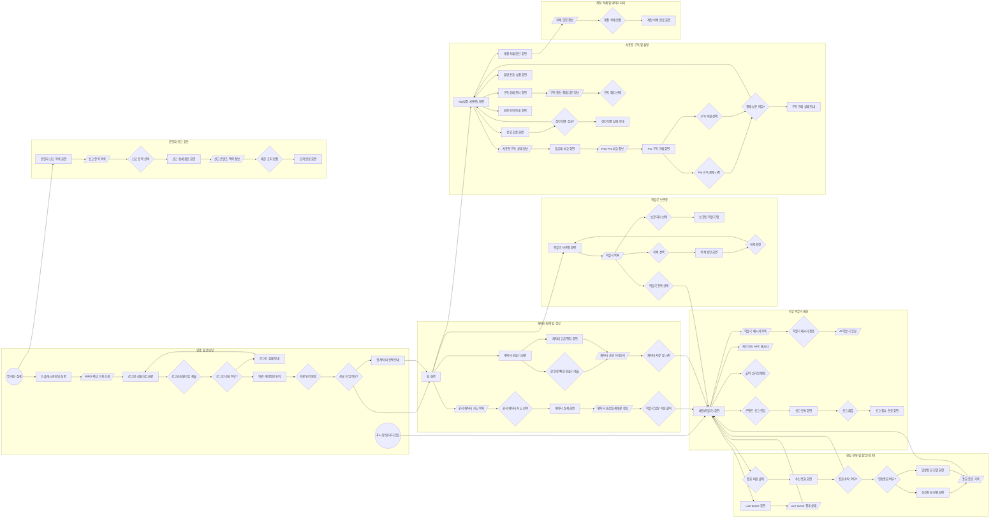

```mermaid
flowchart LR

  subgraph s1 ["인증 및 온보딩"]
    n1(("앱 최초 실행"))
    n2(("푸시 알림 터치 진입"))
    n3["스플래시·온보딩 화면"]
    n4[/"MIRO 핵심 가치 소개"/]
    n5["로그인·회원가입 화면"]
    n6{"로그인/회원가입 제출"}
    n7{"로그인 성공 여부?"}
    n8["로그인 실패 안내"]
    n9["약관·개인정보 동의"]
    n10{"약관 동의 완료"}
    n11{"신규 가입 여부?"}
    n12["첫 캐릭터 선택 안내"]
  end

  subgraph s2 ["캐릭터 탐색 및 생성"]
    n13["홈 화면"]
    n14[/"공식 캐릭터 카드 목록"/]
    n15{"공식 캐릭터 카드 선택"}
    n16["캐릭터 상세 화면"]
    n17[/"캐릭터 프로필·세계관 정보"/]
    n18{"역할극 입장 버튼 클릭"}
    n19["캐릭터 만들기 화면"]
    n20{"한 문장 빠른 만들기 제출"}
    n21["캐릭터 고급 편집 화면"]
    n22[/"캐릭터 초안 미리보기"/]
    n23{"캐릭터 저장 및 시작"}
  end

  subgraph s3 ["자유 역할극 대화"]
    n24["채팅(역할극) 화면"]
    n25[/"역할극 메시지 목록"/]
    n26{"역할극 메시지 전송"}
    n27[/"AI 역할극 응답"/]
    n28[/"사건 카드·NPC 메시지"/]
    n29{"출력 스타일 변경"}
    n30{"콘텐츠 신고 진입"}
    n31["신고 양식 화면"]
    n32{"신고 제출"}
    n33["신고 접수 완료 화면"]
  end

  subgraph s4 ["현실 연동 및 몰입 미디어"]
    n34["수신 통화 화면"]
    n35{"통화 수락 여부?"}
    n36["음성통화 진행 화면"]
    n37["영상통화 진행 화면"]
    n38[/"통화 종료 기록"/]
    n39["Live Scene 화면"]
    n40[/"Live Scene 결과 상태"/]
    n41{"통화 버튼 클릭"}
    n42{"영상통화 여부?"}
  end

  subgraph s5 ["역할극 보관함"]
    n43["역할극 보관함 화면"]
    n44[/"역할극 목록"/]
    n45{"역할극 항목 선택"}
    n46{"보관 처리 선택"}
    n47["보관된 역할극 탭"]
    n48{"삭제 선택"}
    n49["삭제 확인 화면"]
    n50{"삭제 확정"}
  end

  subgraph s6 ["사용량·구독 및 설정"]
    n51["My(설정·사용량) 화면"]
    n52[/"사용량·구독 상태 정보"/]
    n53["요금제 비교 화면"]
    n54[/"Free·Pro 비교 정보"/]
    n55["Pro 구독 구매 화면"]
    n56{"Pro 구독 결제 시작"}
    n57{"결제 성공 여부?"}
    n58["구독 구매 실패 안내"]
    n59{"구독 복원 선택"}
    n60["구독 상태 관리 화면"]
    n61[/"구독 갱신·결제 기간 정보"/]
    n62{"구독 해지 선택"}
    n63["알림·통화 설정 화면"]
    n64["성인 인증 화면"]
    n65{"성인 인증 성공?"}
    n66["성인 인증 실패 안내"]
    n67["권한 동의 안내 화면"]
    n68["계정 삭제 확인 화면"]
  end

  subgraph s7 ["계정 삭제 및 데이터 처리"]
    n69[/"삭제 영향 정보"/]
    n70{"계정 삭제 확정"}
    n71["계정 삭제 완료 화면"]
  end

  subgraph s8 ["운영자 신고 검토"]
    n72["운영자 신고 목록 화면"]
    n73[/"신고 항목 목록"/]
    n74{"신고 항목 선택"}
    n75["신고 상세 검토 화면"]
    n76[/"신고 콘텐츠·맥락 정보"/]
    n77{"제한 조치 확정"}
    n78["조치 완료 화면"]
  end

  n1 --> n3
  n2 --> n24
  n3 --> n4
  n4 --> n5
  n5 --> n6
  n6 --> n7
  n7 --> n8
  n8 --> n5
  n7 --> n9
  n9 --> n10
  n10 --> n11
  n11 --> n12
  n11 --> n13
  n12 --> n13
  n13 --> n14
  n14 --> n15
  n15 --> n16
  n16 --> n17
  n17 --> n18
  n18 --> n24
  n13 --> n19
  n19 --> n20
  n20 --> n22
  n19 --> n21
  n21 --> n22
  n22 --> n23
  n23 --> n24
  n24 --> n25
  n25 --> n26
  n26 --> n27
  n24 --> n28
  n24 --> n29
  n24 --> n30
  n30 --> n31
  n31 --> n32
  n32 --> n33
  n24 --> n41
  n41 --> n34
  n24 --> n39
  n34 --> n35
  n35 --> n42
  n35 --> n24
  n42 --> n37
  n42 --> n36
  n36 --> n38
  n37 --> n38
  n38 --> n24
  n39 --> n40
  n40 --> n24
  n13 --> n43
  n43 --> n44
  n44 --> n45
  n45 --> n24
  n44 --> n46
  n46 --> n47
  n44 --> n48
  n48 --> n49
  n49 --> n50
  n50 --> n43
  n13 --> n51
  n51 --> n52
  n52 --> n53
  n53 --> n54
  n54 --> n55
  n55 --> n56
  n56 --> n57
  n57 --> n51
  n57 --> n58
  n55 --> n59
  n59 --> n57
  n51 --> n60
  n60 --> n61
  n61 --> n62
  n51 --> n63
  n51 --> n64
  n64 --> n65
  n65 --> n51
  n65 --> n66
  n51 --> n67
  n51 --> n68
  n68 --> n69
  n69 --> n70
  n70 --> n71
  n72 --> n73
  n73 --> n74
  n74 --> n75
  n75 --> n76
  n76 --> n77
  n77 --> n78
  n1 --> n72
```
